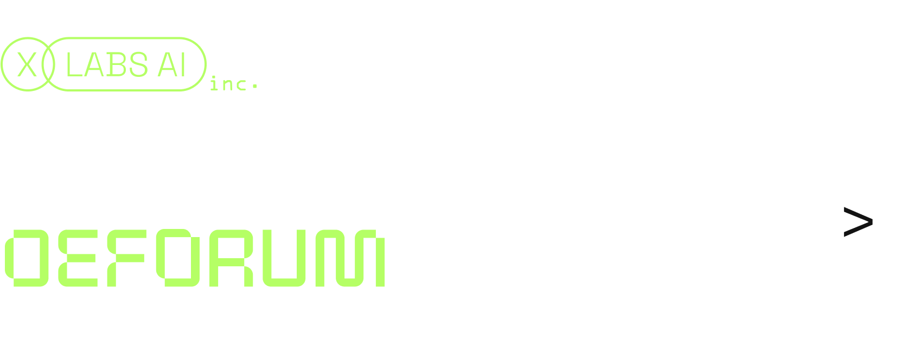

# Deforum based on flux-dev by XLabs-AI

### Clone repository
```bash
git clone --recurse-submodules https://github.com/XLabs-AI/deforum-x-flux.git
cd deforum-x-flux
```
### Install requirements
```bash
pip install -r requirements.txt
```

## Run from CLI
```bash
python run.py
```
Or for a better experience, you can run `DEFORUM_FLUX.ipynb`.
## Examples 

| **Parameters**                                                                                                                                                                           | **Video**                                    |
|------------------------------------------------------------------------------------------------------------------------------------------------------------------------------------------|----------------------------------------------|
| `animation_mode`: `3D` <br>`Translation X`: `0:(0)`<br>`Translation Y`: `0:(0)`<br>`Translation Z`: `0:(7.5)`<br>`Strength Schedule`: `0: (0.65), 12: (0.70), 24: (0.8), 36: (0.85), 38: (0.65)` |           |
| `animation_mode`: `Interpolation` <br> `interpolate_key_frames`: `False`<br>`interpolate_x_frames`: `32`                                                                                                                       |            |

### Prompts

- **0**: "super realism, 4k, a highly detailed close-up view of a woman's mesmerizing blue eye, with realistic reflections and an intense natural sparkle. The iris displays intricate patterns of deep blues and subtle hints of lighter hues, while delicate veins add to the eye's natural complexity. Soft, diffused lighting enhances the eye's depth, with a blurred background to emphasize the eye's captivating beauty and detail."

- **12**: "super realism, 4k, the woman's blue eye transforms into a stunning cosmic scene. Tiny, luminous stars begin to appear within the iris, creating a sense of depth. Nebulae with swirling, ethereal colors—rich purples, blues, and pinks—emerge, blending seamlessly with the natural textures of the eye. The transition is smooth, with the cosmic elements gradually overtaking the eye's surface, adding a layer of wonder and vastness."

- **24**: "super realism, 4k, grand cosmic vista contained within the eye. The eye now features swirling galaxies with vibrant, spiraling arms, and floating celestial bodies such as distant planets and shimmering asteroids. Nebulae continue to swirl with dynamic, vivid colors, creating a surreal and expansive universe that feels both infinite and intimately contained within the eye's bounds."

- **36**: "super realism, 4k, The swirling galaxies and celestial bodies are now accompanied by pulsating stars and radiant supernovae, with intricate light effects and a sense of motion. The smooth transition ensures that the cosmic wonder within the eye remains captivating and visually coherent."

# Acknowledgements
We would like to acknowledge the [Deforum project](https://github.com/deforum-art/deforum-stable-diffusion.git) for their contributions to this implementation.

# Contributing
We are free and happy to see any contributors! Feel free to submit issues, suggest improvements, or contribute code.

# TODO
- [x] Quantized Flux integration
- [ ] Integration with ControlNet
- [ ] IP-adapter integration

# Join Us
For updates and discussions, join our [Discord server](https://discord.gg/Hw8cpX6P).
[](https://discord.gg/FHY2guThfy)
